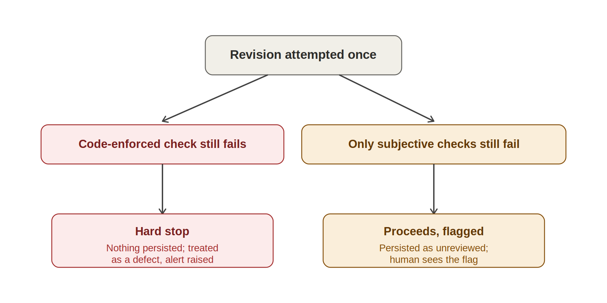

**OnePulse — High-Level Design**

*Step 7 of 10 \| Service Behavior & Resilience \| Ref: OnePulse PRD
v1.0*

This document specifies how each service behaves internally — the actual
sequences, decision logic, and failure handling — building on the
technology assigned in Physical Architecture. It closes both items
explicitly carried forward from Step 6: the Onboarding Service's
completeness mechanism, and a real design answer for NFR-12's
availability target.

# 1. Onboarding Completeness Mechanism (closes the Step 6 carry-forward)

The proof of concept's real gap: Discovery Agent generated whichever
configuration artifacts the conversation happened to cover, with no
mechanism forcing it to cover all of them — which is exactly how a new
project was left without two required skill types until a live run
failed. The fix is a fixed, code-enforced manifest, not a better
conversation.

|                                      |                                                                    |
|--------------------------------------|--------------------------------------------------------------------|
| **Required Artifact**                | **Purpose**                                                        |
| Feature-agent configuration          | Entry criteria and hierarchy for investigating tracked work items. |
| Status-report-agent configuration    | Parsing conventions for that program's status report format.       |
| Synthesis-agent configuration        | Tone and narrative style preferences for that program.             |
| Critique-agent configuration         | Rubric criteria specific to that program's reporting standard.     |
| Slide-generation-agent configuration | The locked visual template and its flex bounds.                    |

The Onboarding Service iterates this manifest deterministically during
the setup conversation. It cannot mark onboarding complete, and a
program cannot run its first real report cycle, until every item on the
manifest is confirmed present — a hard gate enforced in code, not left
to the conversation's own judgment about when it's done. This is the
same discipline already used elsewhere in this design: a completeness
requirement is guaranteed structurally, not by trusting good behavior.

# 2. Core Report Generation Cycle

The end-to-end sequence for every scheduled or on-demand report cycle:

**1.** Coordination starts the cycle, on schedule or by an authorized
on-demand request.

**2.** Platform Governance checks the tenant's Usage Ledger against the
projected cost of this cycle. If it would exceed the tenant's remaining
budget, the cycle is rejected before any AI cost is incurred.

**3.** Work Item Investigation and Status Update Analysis run in
parallel across every relevant item. A single item's failure is isolated
and flagged — it never fails the whole cycle.

**4.** Results are collected and passed to Narrative Synthesis, which
produces a draft report.

**5.** Deterministic Status Rollup computes the overall status from
individual item statuses — a pure function, always reproducible from the
same inputs.

**6.** Quality Assurance checks the draft. If it fails, exactly one
revision is attempted — see Section 3 for what happens if it fails
again.

**7.** Report Rendering produces the final artifact from the approved
content.

**8.** Human Governance presents the artifact to the accountable Program
Lead. Nothing is final until they approve it.

**9.** On approval: the report and its evidence are persisted, the
approval is recorded with the reviewer's identity, and the content is
indexed for future conversational access.

  

# 3. Revision Cap Decision

If Quality Assurance still finds a failure after the one permitted
revision, what happens next depends on which kind of check is still
failing — this distinction is the single most important design decision
carried forward from the proof of concept.

*Figure 5 — a code-enforced check failing twice, independently, is
treated as a software defect, not a content judgment call.*

The reasoning: code-enforced checks (such as the risk floor — no
critical item may be silently dropped) are re-verified independently at
two separate points in the pipeline. If both independently arrive at
different answers, the two implementations disagree with each other,
which can only mean a defect exists somewhere — not that the content is
merely imperfect. Silently proceeding would bury a real bug inside what
looks like an ordinary content-quality outcome. Subjective,
skill-defined checks (tone, conciseness) failing at the cap is a
legitimate, expected outcome of judgment not landing perfectly every
time, and is exactly the kind of thing the mandatory human review step
exists to catch.

# 4. Other Core Flows

## 4.1 Human Governance — Approval or Rejection

Approval and rejection are handled differently, deliberately. Approval
completes the cycle: the decision, reviewer identity, and timestamp are
recorded, and the report becomes visible to the Portfolio Lead.
Rejection is not treated as another automated revision opportunity — a
Program Lead's rejection is a signal that something needs real,
human-driven correction (a data or configuration issue, not a wording
issue), so it requires recorded notes and flags the report for manual
follow-up rather than silently re-queuing another automated attempt.

## 4.2 Conversational Access

**1.** A question is submitted along with the asker's identity.

**2.** Identity, Access & Isolation resolves the asker's authorized
scope — every program in their portfolio for a Portfolio Lead, or their
own program only for a Program Lead.

**3.** The question is embedded and the Retrieval Index is queried,
filtered by that scope — the filter is applied as part of the search
itself, never as a step that could be skipped, since a shared index
without an enforced filter would leak one tenant's data into another's
answer.

**4.** Retrieved content, with its source report and date, is passed to
the model.

**5.** The answer is grounded exclusively in what was retrieved, with a
citation. If nothing relevant is found, the response says so honestly
rather than falling back to an ungrounded answer.

# 5. Resilience & Error Handling

|                                         |                                                                                                                                                                   |
|-----------------------------------------|-------------------------------------------------------------------------------------------------------------------------------------------------------------------|
| **Pattern**                             | **Applied To**                                                                                                                                                    |
| Per-item failure isolation              | Work Item Investigation and Status Update Analysis — one item's failure is flagged, never fails the whole cycle.                                                  |
| Bounded retry with backoff              | Transient failures calling external systems (the work tracking API, Foundry) — handled by Temporal's built-in retry policies, not custom code.                    |
| Hard stop on code-enforced disagreement | The revision cap decision in Section 3 — treated as a defect signal, never silently absorbed.                                                                     |
| Durable workflow state                  | The entire cycle survives a worker process restart mid-execution without losing progress — the reason Temporal was chosen over a simpler request/response design. |

# 6. Availability Design (closes NFR-12)

The 99.5% target set in Step 2 was a placeholder pending a real design.
The composite design here justifies it:

|                                             |                                                                                                                                                                    |
|---------------------------------------------|--------------------------------------------------------------------------------------------------------------------------------------------------------------------|
| **Layer**                                   | **Approach**                                                                                                                                                       |
| Compute (AKS)                               | Every service runs multiple replicas spread across availability zones. A single pod or node failure does not cause downtime; Kubernetes reschedules automatically. |
| Database (Neon)                             | A managed service with its own published availability commitment, independent of anything this design builds.                                                      |
| Workflow (Temporal Cloud)                   | A managed service with its own published availability commitment.                                                                                                  |
| Model access (Foundry) and Gateway (Apigee) | Both managed services with their own published availability commitments.                                                                                           |

Chaining several independently-managed services means the system's real
availability is the product of each dependency's own uptime, not any
single number chosen in isolation. Combined with AKS-level redundancy
absorbing most transient failures before they ever reach a dependency, a
99.5% target is realistic without requiring this design to build its own
failover logic from scratch. The exact published SLA for each managed
service should be confirmed during procurement, not assumed from this
document alone.

  

*This completes behavioral design for every core flow. Low-Level Design
(Step 8) specifies exact schemas, API request and response contracts,
and service configuration.*
