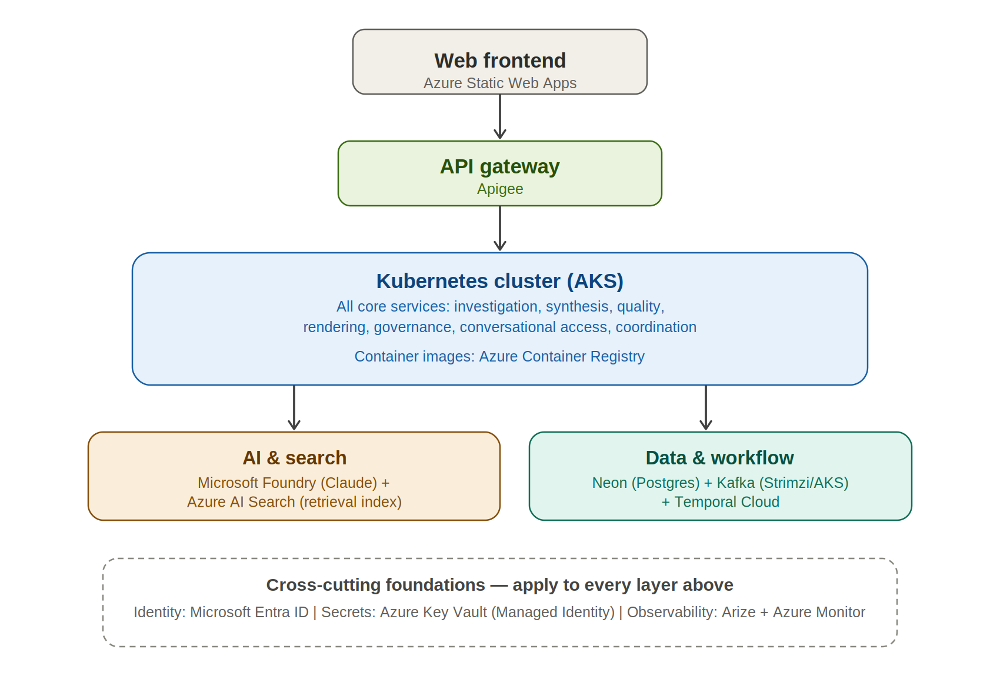

**OnePulse — Physical Architecture**

*Step 6 of 10 \| Technology & Deployment Topology \| Ref: OnePulse PRD
v1.0*

This document assigns real technology to every component and data store
defined in Conceptual and Logical Architecture. Every choice below is
justified against a specific requirement, a specific prior finding from
the singleSlide_demo proof of concept, or an explicit decision made
earlier in this design process — not chosen by default.

# 1. Deployment Topology

*Figure 4 — physical layers: client, gateway, compute, AI/search,
data/workflow, and the cross-cutting foundations spanning all of them.*

# 2. Technology Mapping — Core Pipeline

|                              |                                                                                                                  |                                                                                                                                                        |
|------------------------------|------------------------------------------------------------------------------------------------------------------|--------------------------------------------------------------------------------------------------------------------------------------------------------|
| **Logical Component**        | **Technology**                                                                                                   | **Justification**                                                                                                                                      |
| Work Item Investigation      | AKS service; Claude (Sonnet 5) via Microsoft Foundry; official Azure DevOps MCP server                           | Foundry gives Managed Identity auth and unified Azure billing — directly closes the static-credential exposure risk from the proof of concept (NFR-2). |
| Status Update Analysis       | AKS service; Claude via Foundry; custom PPTX-parsing MCP server                                                  | Same model/auth path as above, kept consistent across every AI component.                                                                              |
| Narrative Synthesis          | AKS service; Claude via Foundry, zero tool calls                                                                 | No external tool access needed at this stage — narrower attack surface than Investigation.                                                             |
| Quality Assurance & Revision | AKS service; Claude via Foundry; explicit call to Azure AI Content Safety                                        | Foundry does not apply automatic content filtering to Claude — a real, confirmed gap — so this check is built explicitly, not assumed (NFR-8).         |
| Deterministic Status Rollup  | Shared code library, embedded directly in the Synthesis service — not a separate deployment                      | A cheap, pure function; making it a separate network call would add latency and a failure mode for no benefit.                                         |
| Report Rendering             | AKS service; deterministic rendering logic; one-time Claude call (via Foundry) only at first-time template setup | Matches the demo's own proven two-mode design: agentic only once per project, fully deterministic every week after.                                    |
| Human Governance             | AKS service (Review API); rendered artifacts in Azure Blob Storage                                               | Blob Storage is the natural home for rendered report files, alongside the rest of the Azure footprint.                                                 |
| Conversational Access        | AKS service; Claude via Foundry; Azure AI Search for retrieval                                                   | See Section 3 — this is the fully-designed Retrieval Index, built now per explicit decision, not deferred.                                             |

  

# 3. Technology Mapping — Cross-Cutting Foundations

|                                     |                                                                                                                                                                                                                                                          |                                                                                                                                                                                                                                                                                                                                                                                                                                                                                                                       |
|-------------------------------------|----------------------------------------------------------------------------------------------------------------------------------------------------------------------------------------------------------------------------------------------------------|-----------------------------------------------------------------------------------------------------------------------------------------------------------------------------------------------------------------------------------------------------------------------------------------------------------------------------------------------------------------------------------------------------------------------------------------------------------------------------------------------------------------------|
| **Logical Component**               | **Technology**                                                                                                                                                                                                                                           | **Justification**                                                                                                                                                                                                                                                                                                                                                                                                                                                                                                     |
| Identity, Access & Isolation        | Microsoft Entra ID (authentication); Apigee policies (authorization, rate limiting); Postgres Row-Level Security on Neon (data isolation)                                                                                                                | Enforced at the database layer, not application code alone — directly satisfies NFR-1's explicit requirement.                                                                                                                                                                                                                                                                                                                                                                                                         |
| Configuration & Onboarding          | AKS service wrapping the proven Discovery Agent conversational logic; writes to the Configuration Store                                                                                                                                                  | Reuses a working, demo-validated approach; extended to guarantee complete coverage per FR-14.                                                                                                                                                                                                                                                                                                                                                                                                                         |
| Coordination                        | Temporal Cloud (durable workflow); Kafka via the Strimzi operator on AKS (event fan-out)                                                                                                                                                                 | Temporal specifically handles the long human-approval wait state that a simple request/response call cannot represent well; no true Azure-native equivalent exists.                                                                                                                                                                                                                                                                                                                                                   |
| Platform Governance & Observability | Arize (LLM cost, latency, and quality tracing) with tenant_id, portfolio_id, and program_id as mandatory attributes on every span; Azure Monitor (infrastructure-level metrics); a separate Usage Ledger table in Neon checked before every cycle starts | Two different, necessary telemetry systems — Arize answers “is the AI behaving well,” Azure Monitor answers “is the infrastructure healthy.” The pre-execution ledger check resolves the cost-governance gap (NFR-6). Separately and explicitly: every Arize span must carry tenant/portfolio/program scope — without this, a real cost or quality anomaly (as happened in the proof of concept) is unattributable to a specific tenant at production scale, defeating the point of per-tenant observability (NFR-7). |

# 4. Data Store Physical Design

|                           |                                                                                                                       |                                                                                                                                                                                                                                                                                    |
|---------------------------|-----------------------------------------------------------------------------------------------------------------------|------------------------------------------------------------------------------------------------------------------------------------------------------------------------------------------------------------------------------------------------------------------------------------|
| **Logical Store**         | **Technology**                                                                                                        | **Design Note**                                                                                                                                                                                                                                                                    |
| Report & Evidence Store   | Neon (Postgres)                                                                                                       | Relational tables, keyed through the Tenant → Portfolio → Program hierarchy defined in Logical Architecture.                                                                                                                                                                       |
| Approval & Governance Log | Neon (Postgres), same instance, append-only table with no update or delete permission granted to the application role | The append-only guarantee is enforced at the database permission level, not just by application discipline — consistent with this project's standing rule of enforcing guarantees in code, never trusting good behavior alone.                                                     |
| Configuration Store       | Neon (Postgres), same instance                                                                                        | Co-located with the other stores; distinguished by access pattern (Section 4.3, Logical Architecture), not by separate infrastructure.                                                                                                                                             |
| Retrieval Index           | Azure AI Search, populated via an Indexing Service triggered by Kafka events whenever a report is finalized           | Built now, as part of the full system, per explicit decision — not deferred despite being the most infrastructure-heavy single item in the whole design. Embeddings generated via a Foundry-hosted embedding model, matching the same model/auth path as every other AI component. |

# 5. Network & Security Topology

Kafka and the core services run inside the AKS cluster's private
network. Temporal Cloud and Neon are external managed services reached
over the public internet with TLS — an explicit, accepted trade-off: a
production system handling regulated data would use private connectivity
(Private Link or VNet peering) where each vendor supports it, but this
is not required for the current requirement set and is noted here as a
known, deliberate simplification, not an oversight.

Every credential is resolved through Managed Identity at the point of
use — the Azure DevOps connector, the Foundry model calls, and the
Postgres connection all authenticate this way. No static API key or
connection secret is stored in application configuration, directly
closing the credential-exposure risk observed multiple times during the
proof of concept (NFR-2).

# 6. Environments

Three environments: Development, Staging, and Production, each a
separate AKS namespace and a separate Neon branch. Azure DevOps
Pipelines promote a build through all three, with the
migration-verification and cost-regression gates (already designed in
the DevOps planning for this project) required to pass before any
promotion to Production.

# 7. Step 2 Gap Closure Status

|                                                   |                                                                                                                                                                                                                                                                              |
|---------------------------------------------------|------------------------------------------------------------------------------------------------------------------------------------------------------------------------------------------------------------------------------------------------------------------------------|
| **Gap**                                           | **Status**                                                                                                                                                                                                                                                                   |
| No portfolio hierarchy in the data model          | Resolved — real entity in Logical Architecture §4.1, enforced via Postgres Row-Level Security here.                                                                                                                                                                          |
| FR-14's fix never designed, only required         | Partially resolved — every layer now structurally requires completeness, but the actual mechanism by which Onboarding Service guarantees every skill type is generated is not yet designed. Explicitly deferred to High-Level Design (Step 7), not silently carried forward. |
| Cost governance was request-count, not cost-based | Resolved — the Usage Ledger, checked before every cycle starts, is a distinct mechanism from Apigee's request counting.                                                                                                                                                      |
| tenant_id missing from trace schema               | Resolved in this revision — explicitly required as a mandatory Arize span attribute in Section 3, not merely implied by naming Arize as the tool.                                                                                                                            |
| No reviewer attribution on approval               | Resolved — captured directly in the ApprovalRecord entity and the recordDecision interface in Logical Architecture.                                                                                                                                                          |

  

*This completes technology assignment for every component in Conceptual
and Logical Architecture. High-Level Design (Step 7) defines how each
service behaves internally — including the Onboarding Service's
completeness mechanism, carried forward explicitly above — and specifies
where NFR-12's availability target gets a real design answer. Low-Level
Design (Step 8) specifies exact schemas, API contracts, and
configuration.*
